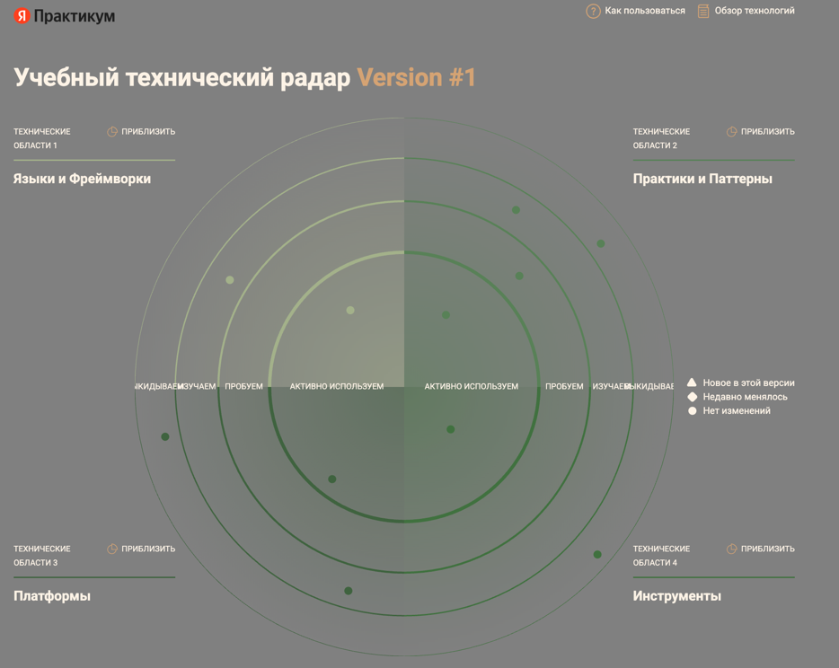
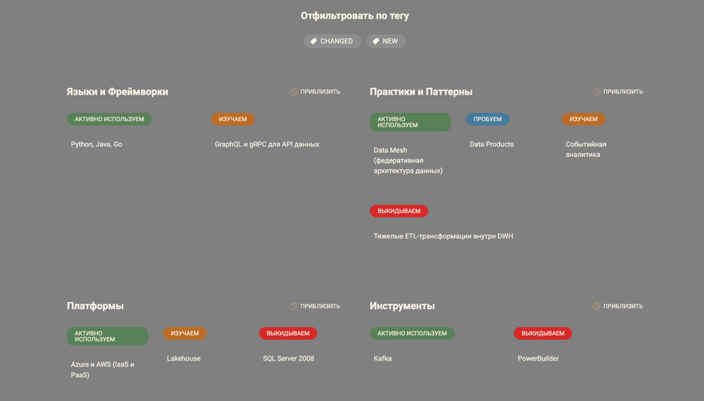
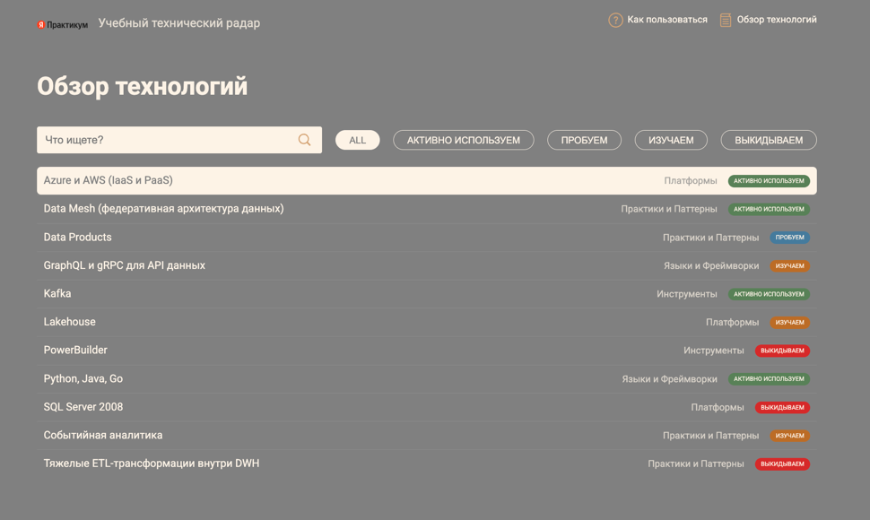

## Техрадар

Как запустить локально:

1. Переходим в папку: cd tech_radar
2. Собираем: npm run build
3. Запускаем сервер: npm run serve
4. Открываем в браузере: localhost:3000

### Скриншоты

---

## План работ

| Этап                                 | Зачем нужен                                      | Основные задачи                                                                                  | Что получим                                                                                     | Кто делает                                             | Что потребуется                                              |
|--------------------------------------|--------------------------------------------------|--------------------------------------------------------------------------------------------------|-------------------------------------------------------------------------------------------------|--------------------------------------------------------|--------------------------------------------------------------|
| Подготовка                           | Разобраться с текущим состоянием и границами     | Архитектурная сессия, аудит DWH, поднять облачную песочницу, обучить команду                     | Понятные границы доменов, найдены узкие места, облако готово к работе                           | Архитекторы, команда DWH, DevOps                       | Консультанты, облачный аккаунт, мониторинг                   |
| Платформа данных и self-serve        | Дать командам базу для работы с данными          | Каталог данных, безопасность, пилотные трансформации в dbt, messaging backbone                   | Каталог работает, трансформации через платформу, шина сообщений жива                            | Платформенная команда, Data engineers, Security        | Каталог, dbt-пайплайны, Kafka или Pulsar, IAM                |
| Витрина и подключение доменов        | Дать пользователям самостоятельно строить отчеты | Разработка витрины, подключаем медицину и ИИ, оптимизируем отчеты, следим за качеством           | Портал запущен, домены публикуют data products, отчеты стали быстрее, метрики качества на месте | BI / frontend, доменные команды, platform team         | UI/UX, BI-библиотеки, вычислительные мощности, observability |
| Интеграция доменов и отказ от легаси | Расширять экосистему без перегрузки центра       | Подключаем фарму и оборудование, выносим логику из DWH, внедряем streaming, обновляем интерфейсы | Новые домены на борту, централизованные трансформации уходят, интерфейсы обновлены              | Доменные команды, архитекторы, frontend, platform team | Pipelines, API, streaming, UI-стек, ресурсы на миграцию      |
| Финал миграции и масштабирование     | Завершить переход и оптимизировать затраты       | Переносим оставшиеся отчеты, FinOps, внешние API, улучшаем UX, резервирование и DR               | DWH как архив, затраты под контролем, партнерские API работают, витрина удобная                 | Platform / Infra / FinOps / интеграционные команды     | FinOps, DR-инфраструктура, API-шлюзы, мониторинг, аналитика  |

---

## Почему именно такой порядок

| Этап                         | Зачем это                                            | Какая польза                                                   | Главные плюсы                                            |
|------------------------------|------------------------------------------------------|----------------------------------------------------------------|----------------------------------------------------------|
| Подготовка                   | Заложить фундамент и снизить риски                   | Четкое разделение доменов, видим узкие места                   | Быстрее идут следующие этапы, меньше сюрпризов           |
| Платформа данных             | Дать техническую базу для доменных data products     | Меньше узких мест в централизованных ETL, команды автономнее   | Быстро создаем продукты, скорость изменений растет       |
| Витрина и домены             | Демократизировать данные, убрать очереди на BI       | Пользователи сами строят отчеты, меньше зависимости от ИТ      | Решения принимаются быстрее, аналитики разгружены        |
| Интеграция и отказ от легаси | Масштабироваться и стать устойчивее                  | Новые направления подключаются без перегрузки центра           | Гибкость, независимость, больше возможностей             |
| Финал миграции               | Завершить переход, контролировать расходы и качество | Легаси уходит, расходы управляемы, отказоустойчивость на месте | Затраты оптимизированы, высокая доступность и надежность |