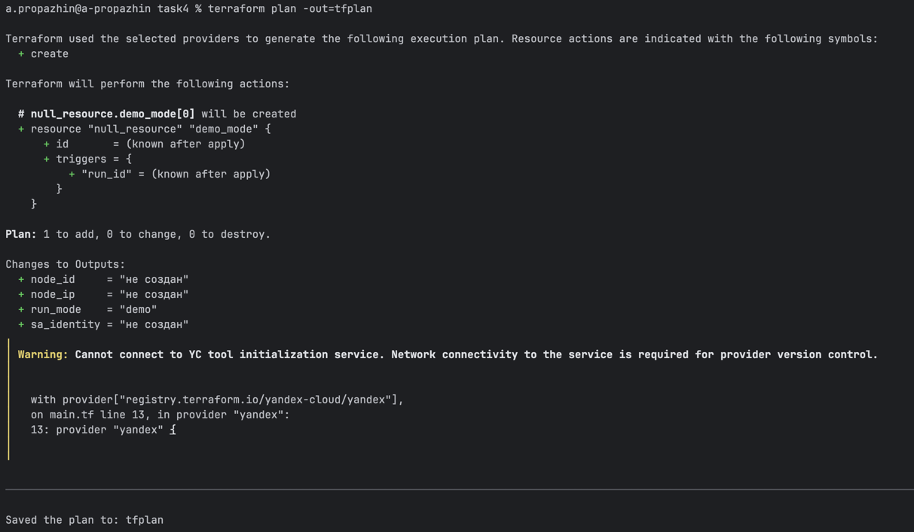
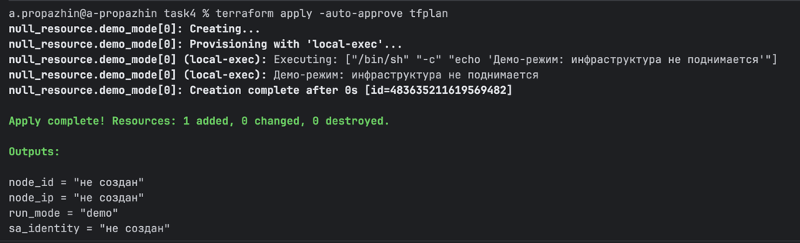

## Автоматизация развертывания через Terraform

Шаблон диаграммы взят отсюда: https://plantuml.com/ru/deployment-diagram

Файл с диаграммой: [terraform-deploy-automation.puml](terraform-deploy-automation.puml)

---

## Конфигурация Terraform

### Как запустить

1. Инициализация

```bash
terraform init
```

2. Проверка конфигурации

```bash
terraform validate
```

3. Планирование изменений

```bash
terraform plan -out=tfplan
```

4. Применение в sandbox режиме

```bash
terraform apply -auto-approve tfplan
```

Результат:





### Почему выбрали именно так

Подробнее: [justification.md](justification.md)